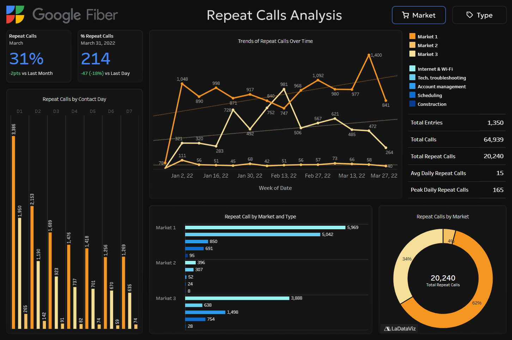
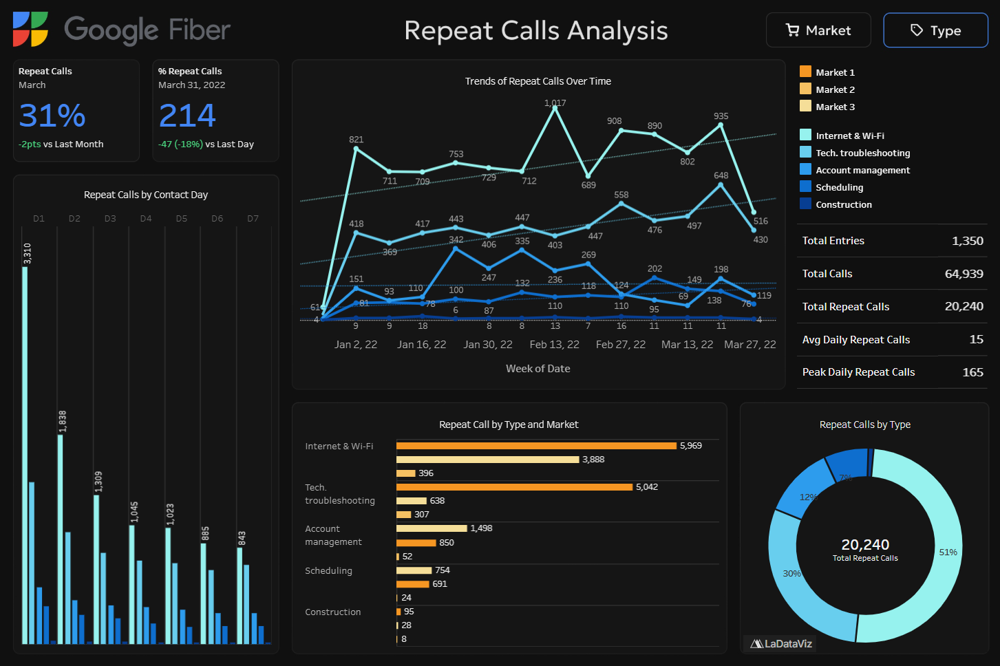

# Google Fiber Call Center

> **Course**: Google Professional Certificate in Business Intelligence  
> **Project**: Repeat Caller Analysis (Call Center Data)  
> **Date**: November 2025

This first project, part of the Google Professional Certificate in BI, analyzes **repeat calls** to the Google Fiber call center to identify trends and generate insights that improve **first-contact resolution** and **customer satisfaction**.

## [Dashboard](https://public.tableau.com/app/profile/samuel.bouchereau/viz/GoogleFiberCallCenterRepeatCallsAnalysis/Type) | [Data Cleaning](./data/cleaning.ipynb) | [Documentation](./documentation)

## Preview

  
Market View

  

  
Type View

  

## Dataset

The dataset contains call center interaction records used to analyze repeat customer calls and service efficiency. Each row represents a **customer contact event**, including call volume, repeat interactions, call category, market location, and timing relative to the initial contact. A complete and detailed list of all available data fields, along with data cleaning and preprocessing steps, can be found in the `cleaning.ipynb` notebook.

> [!NOTE]  
> Market names and customer details are **anonymized** to protect privacy.  
> Repeat call indicators reflect follow-up contacts within defined time windows.  
> Call types are high-level categories and may not capture all underlying issue complexity.

## Stakeholders

| Name              | Role            | Interest                   | Viewer |
|-------------------|-----------------|----------------------------|--------|
| **Emma Santiago** | Hiring Manager  | Primary contact            | ✅      |
| **Keith Portone** | Project Manager | Primary contact            | ✅      |
| **Minna Rah**     | Lead BI Analyst | Accessibility requirements | ✅      |
| **Ian Ortega**    | BI Analyst      |                            | ✅      |
| **Sylvie Essa**   | BI Analyst      |                            | ✅      |

## Key questions
1. How **often** does the customer service team receive repeat calls from customers?
2. What **problem types** generate the most repeat calls?
3. Which **market city’s** customer service team receives the most repeat calls?

## Features

* Analyzes repeat calls by market, problem type.
* Provides trend analysis by week, month, quarter, and year.
* Helps identify operational improvements and reduce call volume.

## Insights

- **Call Volume Concentration:** Market 1 generates the highest volume of total calls and repeat calls, indicating a disproportionate share of customer support demand.  
- **Primary Drivers of Repeat Calls:** Internet & Wi-Fi issues and Technical Troubleshooting account for 81% of all repeat calls, identifying the most critical areas for improving first-contact resolution and customer satisfaction.

## Tools

- **Python** — Data cleaning  
- **SQL Server** — Data exploration and transformation  
- **Tableau** — Data visualization and dashboard development  
- **Git & GitHub** — Version control
- **Figma** — Dashboard layout and design planning

## License

This project is licensed under the MIT License.  
You are free to use, modify, and distribute this project with proper attribution.