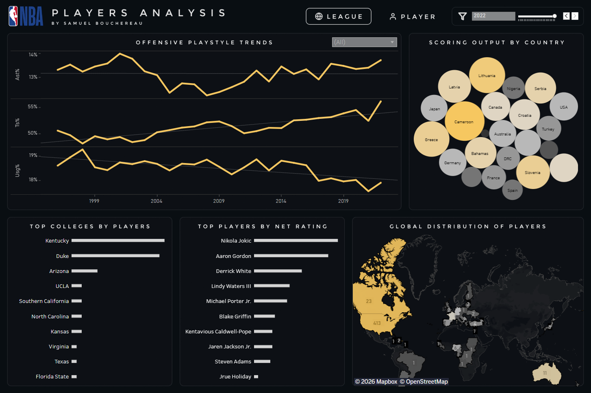

# NBA Players: League Trends & Playstyle Analysis

This project analyzes NBA player data across multiple seasons to understand how the league has evolved in terms of **international representation**, **talent development pipelines**, and **on-court playstyle**. The dashboard focuses on long-term trends at both the league and individual player levels, combining geographic, biographical, and advanced performance metrics.

## [Dashboard](https://public.tableau.com/app/profile/samuel.bouchereau/viz/NBAPlayersTrendsPerformanceandPlaystyleAnalysis/League) | [Data Cleaning](./data/cleaning.ipynb)

## Preview

  
League View

  

  
Player View

  

## Dataset

The dataset contains NBA player-level statistics covering **seasons from 1996 to 2022**. Each row represents a **player’s performance for a given season**, combining biographical information, draft details, playing time, and both traditional and advanced performance metrics. All data cleaning, validation, and preprocessing steps are documented in the [`cleaning.ipynb`](./data/cleaning.ipynb) notebook.

> [!NOTE]  
> Advanced metrics may be less reliable for players with **limited games played**; minimum game thresholds are applied where appropriate.  
> Extreme values in metrics such as **Net Rating** can occur due to small sample sizes.

## Analytical Questions

1. How has **international representation** in the NBA evolved over time?  
2. Which **countries** consistently produce high-efficiency scorers?  
3. Which **colleges** contribute the largest share of NBA players?  
4. How has **NBA playstyle** evolved in terms of usage, assists, and scoring efficiency?

## Visualization

### 1. League-Wide Trends Analysis
This section focuses on long-term, league-level patterns related to player origin, scoring efficiency, and offensive playstyle.

- **Map** — Geographic distribution of NBA players by country across seasons  
- **Bubble Chart** — Average points per game by country  
- **Bar Charts**:
  - Top 10 colleges by total NBA player count  
  - Top 10 players ranked by net rating  
- **Line Charts** — League-wide trends in:
  - Assist Percentage (`ast_pct`)
  - True Shooting Percentage (`ts_pct`)
  - Usage Percentage (`usg_pct`)
- **Interactive Filters**
  - **Season** — Explore year-over-year trends  
  - **Team** — Analyze team-level playstyle patterns

### 2. Individual Player Analysis
This section provides a detailed, player-centric view, combining performance trends with contextual playstyle indicators.

- **Player Summary Card** — Key information from the most recent season played
- **Map** — Player’s country of origin  
- **Table** — Season-by-season statistical breakdown  
- **Radar Chart** — Playstyle profile based on:
  - True Shooting Percentage (`ts_pct`)
  - Offensive & Defensive Rebound Percentage (`oreb_pct`, `dreb_pct`)
  - Assist Percentage (`ast_pct`)
  - Usage Percentage (`usg_pct`)
- **Line Charts** — Career trends in:
  - Points per game (`pts`)
  - Net rating (`net_rating`)
  - Assists per game and assist percentage (`ast`, `ast_pct`)
  - Usage Percentage (`usg_pct`)
  - True Shooting Percentage (`ts_pct`)
- **Interactive Filter**:
  - **Player Filter** — Updates all views dynamically

## Insights

- **Internationalization of the NBA:** The share of international players has increased steadily, with a pronounced acceleration beginning in the early 2000s.  
- **Country-Level Efficiency:** The United States remains the leading contributor of NBA players by a wide margin, followed by Canada, France, and Australia.  
- **College Dominance:** A limited number of collegiate programs account for a disproportionate share of NBA players, with Kentucky and Duke leading over the analyzed period.  
- **Playstyle Evolution:** League-wide trends show a shift toward greater ball movement, more distributed offensive responsibility, and improved scoring efficiency.

## Skills Demonstrated

- Data cleaning and preprocessing with Python  
- Structured exploratory analysis using SQL Server  
- Advanced, interactive dashboards built in Tableau  
- Longitudinal trend analysis across multiple seasons  
- Use of advanced basketball efficiency and playstyle metrics  
- Clear documentation and reproducible workflows

## Potential Improvements

- Integration of post-2022 seasons for continued trend tracking
- Position-based playstyle comparisons (guards vs forwards vs centers)
- Team-level defensive metrics and lineup analysis
- Enhanced normalization of advanced metrics for low-minute players
- Mobile-optimized dashboard layout for improved accessibility on smaller screens

## Tools

- **Python** | Data cleaning and preprocessing  
- **SQL Server** | Data exploration and transformation  
- **Tableau** | Data visualization and dashboard development  
- **Figma** | Dashboard layout and design planning  
- **Git & GitHub** | Version control and documentation

## License

This project is licensed under the **MIT License**.  
You are free to use, modify, and distribute this project with proper attribution.