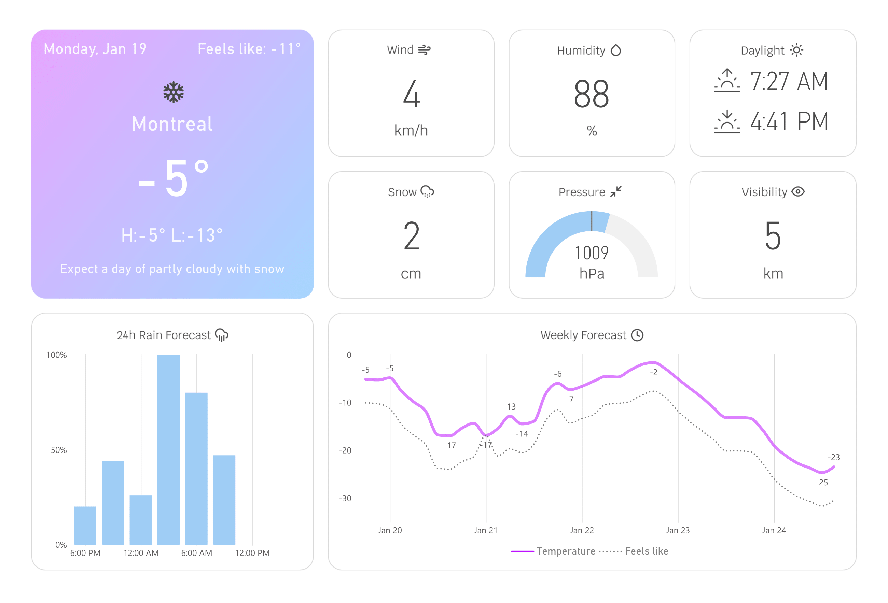

# Montreal Weather: Real-Time & Forecast Analysis

This project is a Montreal weather dashboard built in **Power BI** using live data from the **OpenWeather One Call 3.0** and **Forecast API**. The objective was to design a clean, real-time dashboard that highlights the most relevant weather indicators while demonstrating API integration, data transformation, and dashboard design best practices.

## Preview

  
Main View

  

## Dataset

The dataset is sourced from **OpenWeather One Call 3.0** and **Forecast API** that provides clean, live and forecasted weather data for Montreal. It includes current conditions, short-term 3-hour forecasts, and daily outlooks. Data is refreshed dynamically through API calls and transformed within **Power BI / Power Query** before visualization.

> [!NOTE]
> All metrics are specific to **Montreal** and are intended for city-level analysis only.
> Forecast values may vary based on API refresh timing and data provider updates.

## Analytical Questions

1. What are the **current weather conditions** in Montreal?  
2. How will **temperature evolve** over the next 5 days?  
3. Is **rain** or **snow** expected in the short term?  
4. What are the current **atmospheric conditions** (wind, humidity, pressure, visibility)?

## Visualization
The dashboard design was inspired by the **Apple iOS Weather app**, prioritizing visual hierarchy, intuitive iconography, and fast information scanning.

- **Current Weather** — Summary:
  - Current date
  - Current temperature
  - Feels-like temperature
  - Weather icon
  - City name
  - Daily high & low temperatures
  - Short textual weather summary
- **Bar Chart** — 24-hour rain forecast
- **Line Chart** — 5-day temperature forecast:
  - Temperature
  - Feels-like temperature
- **Cards**:
  - Current wind speed (km/h)
  - Current humidity (%)
  - Daily snowfall (cm)
  - Current visibility (km)
  - Daylight (sunrise & sunset time)
- **Gauge Chart**:
  - Atmospheric pressure (hPa)

## Insights

- **Power BI vs. Tableau**: Power BI enables faster development for API-driven dashboards thanks to its intuitive data modeling and Power Query workflow, making it well-suited for real-time and operational reporting. Tableau, while more flexible for advanced custom visuals, requires more manual effort for comparable data preparation tasks.
- **Montreal Winter Conditions**: Montreal's winter weather highlights the importance of perceived temperature ("feels like") over actual air temperature, reinforcing the value of incorporating comfort-based metrics when designing weather-focused dashboards.

## Skills Demonstrated

- API integration with live and forecasted data sources  
- Data cleaning and transformation using Power Query  
- Time-based analysis (hourly and daily forecasts)  
- Dashboard design with a strong visual hierarchy  
- Cross-platform BI proficiency (Power BI & Tableau)  
- Reproducible, documented BI workflows

## Potential Improvements

- Alert logic for extreme weather conditions  
- Parameterized city selection for multi-location support  
- Historical weather analysis and year-over-year comparisons  
- Performance optimization for larger datasets  
- Deployment through Power BI Service with scheduled refreshes  
- Mobile-optimized dashboard layout for improved accessibility on smaller screens

## Tools

- **OpenWeather APIs** | Live and forecasted weather data  
- **Power Query Editor** | Data exploration and transformation  
- **Power BI** | Data visualization and dashboard development  
- **Figma** | Dashboard layout and design planning  
- **Git & GitHub** | Version control and documentation

## License

This project is licensed under the **MIT License**.  
You are free to use, modify, and distribute this project with proper attribution.