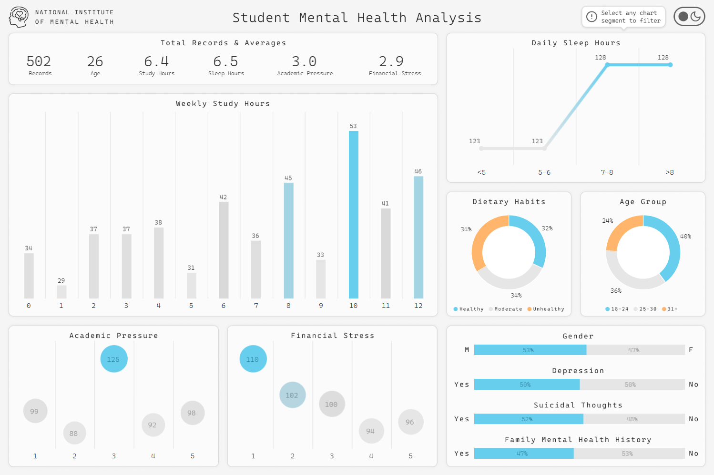
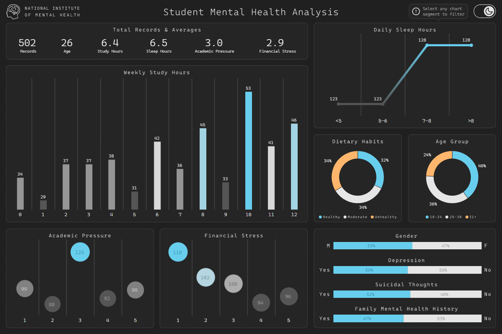

# Student Mental Health: Stress, Sleep, and Risk Factor Analysis

This project explores how **study time**, **sleep duration**, **academic pressure**, and **financial stress** relate to student well-being using survey-based data. The dashboard is fully interactive and designed to surface key risk factors and KPI-level insights through dynamic filtering.

## [Dashboard](https://public.tableau.com/app/profile/samuel.bouchereau/viz/StudentMentalHealthStressSleepandRiskFactorAnalysis/Light_Dashboard) | [Data Cleaning](./data/cleaning.sql)

## Preview

  
Light View

  

  
Dark View

  

## Dataset

The dataset consists of **502 survey-based records** representing students from various profiles. All data cleaning, validation, and preprocessing steps are documented in the [`cleaning.sql`](./data/cleaning.sql) notebook.

Each entry includes:
- Gender (M/F)
- Age
- Age Group (18–24/25–30/31+)
- Weekly Study Hours
- Sleep Duration
- Academic Pressure (1–5 scale)
- Financial Stress (1–5 scale)
- Dietary Habits (Unhealthy/Moderate/Healthy)
- Depression (Yes/No)
- Suicidal Thoughts (Yes/No)
- Family Mental Health History (Yes/No)

> [!NOTE]  
> This dataset is entirely fictional and created for practice purposes. It represents an imaginary survey study conducted by a fictional institution inspired by the *National Institute of Mental Health*.

## Analytical Questions

1. Does **higher academic pressure** align with reported depression?
2. How does **financial stress** distribute across age groups?
3. Do **lower sleep durations** correlate with higher stress levels?
4. What **study-hour range** is most common among students reporting depression?
5. How does **gender** influence reported mental health outcomes?

## Visualization

- **KPI Cards** — Summary metrics:
  - Total Records
  - Average Age
  - Average Study Hours
  - Average Sleep Hours
  - Average Academic Pressure (1–5)
  - Average Financial Stress (1–5)
- **Bar Chart** — Weekly Study Hours distribution (0–12 hours) showing total student records per value
- **Dot Bar Charts**:
  - Academic Pressure distribution (1–5 scale)
  - Financial Stress distribution (1–5 scale)
- **Line Chart** — Sleep duration distribution by total student records:
- **Donut Charts**:
  - Dietary Habits (Unhealthy, Moderate, Healthy)
  - Age Groups (18–24, 25–30, 31+)
- **Split Horizontal Bar Charts** — Percentage breakdowns:
  - Gender (Male/Female)
  - Depression (Yes/No)
  - Suicidal Thoughts (Yes/No)
  - Family Mental Health History (Yes/No)

The dashboard was built in Tableau using **dynamic chart interactions only**. Selecting any element within any chart filters the entire dashboard, eliminating the need for traditional slicers or visible filter panels.

Additionally, the dashboard includes a **Light/Dark mode** toggle, allowing users to switch themes directly within the view. This enhances user experience, accessibility, and visual comfort across different environments, while introducing a modern UI layer that is uncommon in traditional Tableau dashboards.

## Insights

- **Higher Academic Pressure & Depression**: Among students reporting the highest academic pressure (5/5), 85% experience depression. Although this group represents 19% of the dataset (98 of 502 records), the proportion of affected students highlights a strong association between extreme academic stress and mental health risk.
- **Financial Stress Across Age Groups**: The 18–24 age group (40% of the dataset, 200 records) shows the highest financial stress levels, with 45% (89 of 200) reporting stress levels 4–5. In contrast, the 25–30 group (36%, 180 records) is more concentrated in low stress levels, particularly level 1, while the 31+ group (24%, 122 records) is more evenly distributed, with 25% at level 1 and 25% at level 3. This suggests financial pressure disproportionately affects younger students.
- **Sleep Duration & Stress Levels**: No clear correlation is observed between sleep duration and stress levels. Academic pressure and financial stress appear relatively evenly distributed across both low and high sleep categories, indicating that sleep alone is not a strong predictor of stress in this dataset.
- **Study-Hour Range & Depression**: Among students with depression, 40% (102 of 252) study 9+ hours per week. In comparison, among non-depressed students, 36% (91 of 250) study 3 hours or less per week. These distributions suggest a relationship between heavier study loads and reported depression.
- **Gender & Mental Health Outcomes**: Financial stress varies by gender, with 44% of male students (117 of 267) reporting low financial stress (levels 1–2), while 40% of female students (94 of 235) report high financial stress (levels 4–5). Lifestyle patterns also differ slightly: 39% of males report unhealthy dietary habits, whereas 37% of females report healthy habits. Other mental health indicators remain relatively consistent across genders.

## Skills Demonstrated

- Advanced SQL data cleaning & transformation
- Data type standardization for accurate aggregation
- Interactive Tableau dashboard architecture
- Clear documentation and reproducible workflows
- UI theme implementation (Light/Dark mode)
- Survey-based behavioral data analysis

## Potential Improvements

- Addition of a **correlation matrix** or **heatmap** to visually quantify relationships between key variables (academic pressure, financial stress, sleep duration, study hours, and depression)
- Statistical testing (e.g., correlation coefficients or regression analysis) to validate observed patterns
- Exportable summary report for stakeholders or academic presentations
- Integration of additional survey dimensions (e.g., physical activity, social support, employment status) for more comprehensive behavioral analysis
- Mobile-optimized dashboard layout for improved accessibility on smaller screens

## Tools

- **SQL Server** | Data cleaning, exploration, and transformation
- **Tableau** | Data visualization and dashboard development
- **Figma** | Dashboard layout and design planning
- **Git & GitHub** | Version control and documentation

## License

This project is licensed under the **MIT License**.  
You are free to use, modify, and distribute this project with proper attribution.