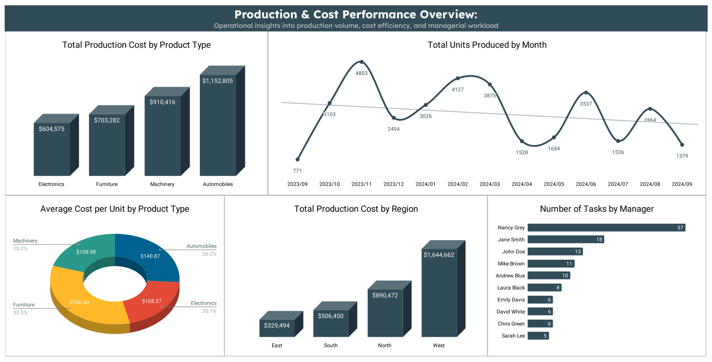
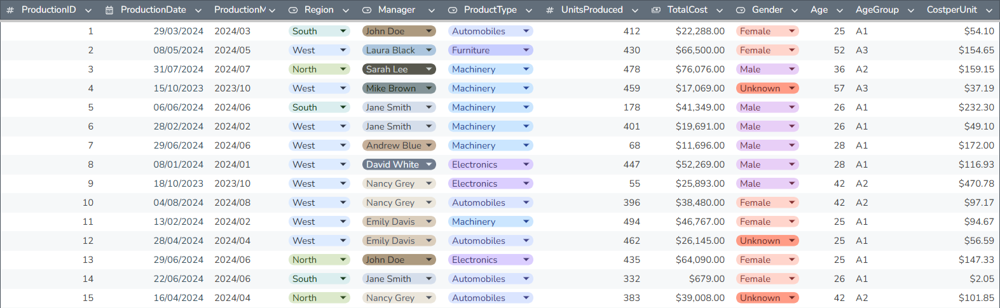

# Apex Industrial Solutions: Production & Cost Performance Analysis

> **Course**: Complete Data Analyst Bootcamp From Basics To Advanced  
> **Project**: Apex Industrial Solutions: Production & Cost Performance Analysis  
> **Date**: January 2026

This project demonstrates how **Google Sheets** can be used to analyze **production operations** data for *Apex Industrial Solutions*, a fictitious manufacturing company operating across multiple regions and product categories.  

## Preview

  
Main View

  

## Dataset

The dataset contains production-level operational records for *Apex Industrial Solutions* from 2023-2024. Each row represents a single production task and includes information about time, region, manager, product type, units produced, total cost, and cost per unit, along with manager demographics (age, age group, and gender).  

  
Data Preview

  

The original dataset contained inconsistent age values for the same manager across multiple production records. Since a manager’s age should be constant, a business rule was applied: the earliest production record for each manager was assumed to contain the correct age value.  

To resolve this issue, the following steps were performed:
1. A separate helper table was created containing only manager names.
2. Duplicates were removed to ensure a single row per manager.
3. The original production dataset was sorted by production date from earliest to latest.
4. A **VLOOKUP** function was then used to retrieve each manager’s age from the first occurrence of that manager in the dataset.
5. The retrieved age was applied consistently across all records for the corresponding manager.

> [!NOTE]  
> All steps, from data cleaning to dashboard creation, were performed exclusively in **Google Sheets**.

## Key questions
1. Which **product types** drive the highest production costs?
2. How are **production tasks** distributed across managers?
3. How does **production volume** change over time?
4. Which **product categories** are most cost-efficient per unit?

## Visualization

- **Column Charts**:
  - Total Production Cost by Product Type
  - Total Production Cost by Region
- **Line Chart** — Units Produced Over Time
- **Donut Chart** — Average Cost per Unit by Product Type
- **Bar Chart** — Total Tasks by Manager

## Insights

- **Highest Production Cost**: Automobiles is the product type with the highest total production cost at $1,152,805, making it the primary driver of overall expenses.
- **Declining Production Trend**: Total units produced per month are decreasing, hitting an all-time low of 1,379 units in September 2024, the lowest since the same month last year.
- **Highest Average Cost per Unit**: Furniture has the highest average cost per unit at $180.44, indicating lower cost efficiency compared to other product types.
- **Regional Cost Concentration**: The West region has the highest total production cost at $1,644,662, nearly double that of the North, the second-highest region.
- **Managerial Workload Distribution**: Nancy Grey completed the most production tasks with 37 tasks, followed by Jane Smith (18 tasks) and John Doe (13 tasks), highlighting concentrated managerial responsibility.

## Tools

- **Google Sheets** | Data cleaning, visualization and dashboard development
- **Git & GitHub** | Version control and documentation

## License

This project is licensed under the **MIT License**.  
You are free to use, modify, and distribute this project with proper attribution.