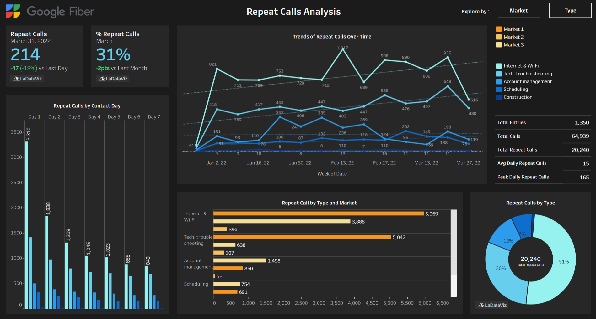

# 📊 Google Fiber

<<<<<<< HEAD:projects/1-google-fiber/README.md
## [🔗 Dashboard v1](https://public.tableau.com/app/profile/samuel.bouchereau/viz/GoogleFiberCallCenterRepeatCallsAnalysis/TypeView)
=======
## [🔗 Dashboard v1](https://public.tableau.com/app/profile/samuel.bouchereau/viz/GoogleFiberCallCenterRepeatCallsAnalysis/MarketView)
>>>>>>> 0699a2721d893d7c4760fa949f8ae39c9cb07157:projects/google-fiber/README.md

This project is part of the Google Professional Certificate in Business Intelligence. The goal is to build a dashboard to analyze **repeat customer calls** to the Google Fiber call center, identify trends, and provide actionable insights to improve first-contact resolution and customer satisfaction.

## Features

* Analyzes repeat calls by market, problem type.
* Provides trend analysis by week, month, quarter, and year.
* Interactive dashboard designed for stakeholders and BI team members.
* Supports accessibility, including large print and text-to-speech alternatives.
* Helps identify operational improvements and reduce call volume.

## 🧠 Key Technologies

Python, SQL, Tableau, Data cleaning, Data storytelling

