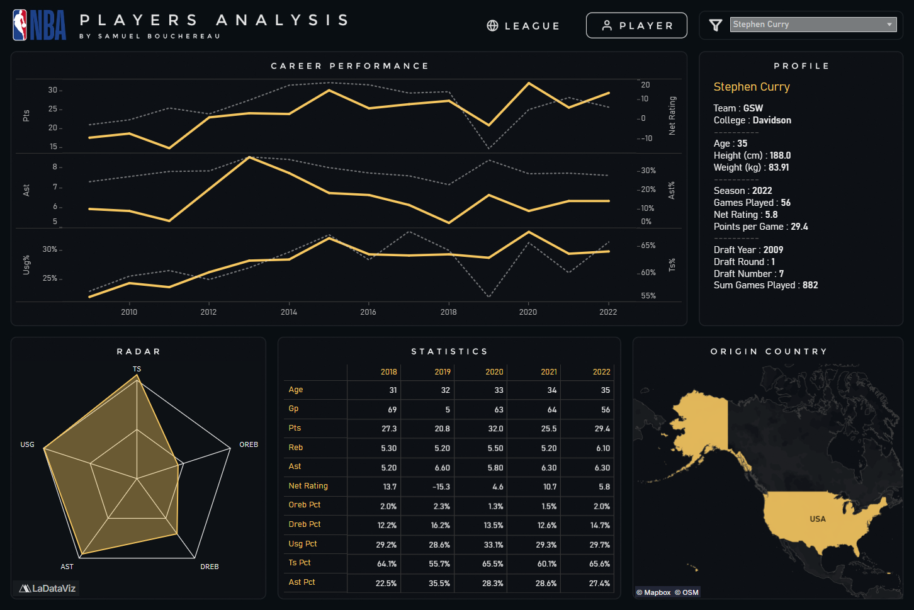

# 🏀 NBA Players

This project analyzes NBA player data across multiple seasons to understand how the league has evolved in terms of **international representation**, **talent development pipelines**, and **on-court playstyle**.

## [🔗 Dashboard](https://public.tableau.com/app/profile/samuel.bouchereau/viz/NBAPlayersTrendsPerformanceandPlaystyleAnalysis/League)

### League Preview

### Player Preview

## 🗂️ Dataset

The dataset contains NBA player-level statistics covering **seasons from 1996 to 2022**. Each row represents a **player’s performance for a given season**, combining biographical information, draft details, playing time, and both traditional and advanced performance metrics. A complete and detailed list of all available data fields, along with data cleaning and preprocessing steps, can be found in the `cleaning.ipynb` notebook.

### Notes & Limitations
- Advanced metrics may be less reliable for players with **limited games played**; minimum game thresholds are applied in selected visualizations.  
- Extreme values in metrics such as **Net Rating** can occur due to small sample sizes.  
- Country and college fields reflect reported player background and may not account for changes over time.

## 👥 Stakeholders

- **League & Media Analysts** — Tracking long-term NBA trends  
- **Front Office & Analytics Teams** — Evaluating global and collegiate talent pipelines  
- **Executives & Decision-Makers** — High-level performance and efficiency insights  
- **Fans & Content Creators** — Understanding how the game has evolved

## ❓ Key Questions

- How has **international representation** in the NBA changed over time?  
- Which **countries** produce the most **efficient scorers**?  
- Which **colleges** contribute the most players to the NBA?  
- How has **NBA playstyle** evolved in terms of usage, assists, and efficiency?

## 🎨 Visualization

### Overall NBA Trends Analysis
This section explores league-wide patterns and long-term evolution in player distribution, scoring, and playstyle.

- **Map** — Geographic distribution of NBA players by country over time  
- **Bubble Chart** — Average points per game by country across seasons  
- **Bar Chart** — Top 10 colleges by total NBA player count over time  
- **Bar Chart** — Top 10 players ranked by net rating over time  
- **Line Charts** — League-wide trends in:
  - Assist Percentage (`ast_pct`)
  - True Shooting Percentage (`ts_pct`)
  - Usage Percentage (`usg_pct`)
- **Interactive Filters**
  - **Season** — Explore trends year by year  
  - **Team** — Analyze playstyle trends for a selected team in the line charts 

### Single Player Analysis
This section provides a detailed view of individual players, combining context, performance trends, and playstyle indicators.

- **Player Card** — Key player information from the most recent season played  
- **Map** — Player’s country of origin  
- **Table** — Season-by-season statistical breakdown  
- **Radar Chart** — Player playstyle profile based on:
  - True Shooting Percentage (`ts_pct`)
  - Offensive and Defensive Rebound Percentage (`oreb_pct`, `dreb_pct`)
  - Assist Percentage (`ast_pct`)
  - Usage Percentage (`usg_pct`)
- **Line Charts** — Career trends in:
  - Points per game (`pts`)
  - Net rating (`net_rating`)
  - Assists per game and assist percentage (`ast`, `ast_pct`)
  - Usage Percentage (`usg_pct`)
  - True Shooting Percentage (`ts_pct`)
- **Interactive Filter**
  - **Player Filter** — Select an individual player to update all views across the dashboard

## 🔍 Insights

- **International Representation:** There has been a steady increase in the number of international players in the NBA, with a particularly sharp rise since 2000.  
- **Top Countries:** The United States remains the leading contributor of NBA players by a wide margin, followed by Canada, France, and Australia.
- **High-Efficiency Scorers (2020–2022):** Cameroon, Lithuania, and Greece averaged the highest number of high-efficiency scorers compared with other countries during this period.  
- **College Dominance:** A small group of colleges dominates NBA player production, with Kentucky leading, followed closely by Duke.  
- **Playstyle Evolution:** NBA offenses have shifted toward greater ball movement, more distributed offensive responsibility, and improved scoring efficiency.

## 🛠️ Tools

- **Python** — Data cleaning  
- **SQL Server** — Data exploration and transformation  
- **Tableau** — Data visualization and dashboard development  
- **Git & GitHub** — Version control  
- **Figma** — Dashboard layout and design planning